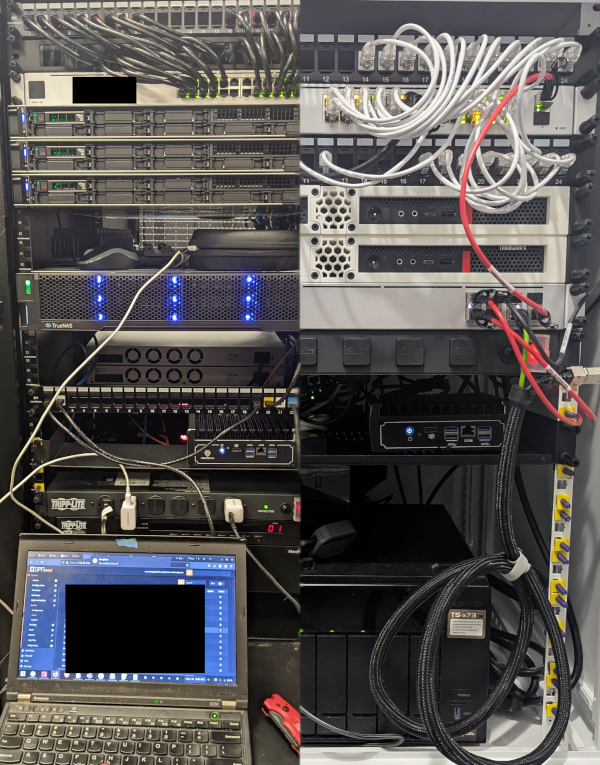
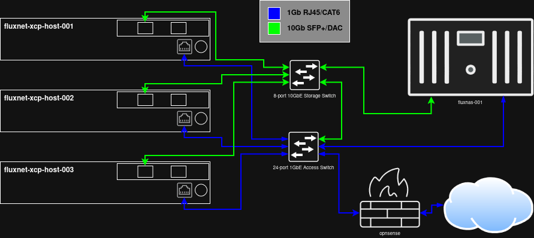

# fluxnet
Description, topology, and high-level configuration of my local fluxnet environment, to help simplify management and provide examples that others can apply in their own environments.

> This page (and this repo) is very much a very early Work-in-Progress.

## My Methodology:

Let's start by describing the environment and why it was designed this way. In a production environment, it would be ideal to strive for redundancy and fault tolerance at every layer, but that is not always feasible depending on many factors. Redundancy can include multiple physical hosts, dual storage controllers and RAID arrays, firewall HA with CARP, LACP internal network links and redundant switches, redundant carrier links, and so on. The most obvious thing preventing redundancy at every layer is cost. Extra physical hosts, network switches, storage controllers, and so on can raise the design cost of an environment by double, if not more. Another element is simply the added complexity that needs to be mitigated by skilled admins and engineers, both in design, management, and maintenance, which again adds to cost. There is a lot of similarity between the production and the lab environments. Both use a single firewall, a single core/access switch and a single storage switch, among other things. Redundancy at these layers /could/ be built in, but I chose this because of the reduced complexity, simpler management, and they can be easily replaced with minimal downtime. If 99.9999% uptime is not required, there is no point in pulling your hair out over it. Literally all of IT is built up like a house of cards, and the balancing act of knowing where to invest time, effort, and money comes down to experience and a bit of luck.

Could this be accomplished with two hosts instead of three? Certainly. The reason I like three identical hosts instead of just two is that you have one more level of peace of mind. I might be wrong, but I think the most likely core physical element of an environment like these to experience downtime is a physical server, or in this case, virtualization host. We have all seen servers lock up for one reason or another, whether it's due to failed updates or something else. With just two hosts, literally everything rests on keeping that other host up while troubleshooting the other host. Maybe its as simple as a reboot, but often it is not. With three hosts, there is a lot more flexibility with remaining resources and how troubleshooting is approached, as well as the unlikelihood of a second host going down and making everything rest on a single host just as in the two host scenario.

Also, when virtualization hosts are treated as ephemeral appliances, as I do with XCP-ng, it becomes near trivial to simply reinstall the OS and rejoin the existing pool if troubleshooting seems like it is not worth the time, or if absolutely necessary. Three hosts allow the decision to reinstall to be much less stressful than just two hosts.

Three hosts also means hypervisor-level High Availability is possible, albeit with that aforementioned complexity. HA is not necessary in these environments, but having three hosts is a huge hurdle already crossed in case it ever does become necessary.

Redundant storage controllers in the production environment meant that the virtualization environment stayed operational in the extremely unlikely event that a single controller went down. There was only one time in the nearly five years of running this TrueNAS appliance that one of the controllers was down for longer than a few short moments due to a failed update, and the remaining controller was just fine the whole time waiting to apply the update until the first controller was good again. It was one of the few times I needed to call on support. Of course, this is perfect example of why redundancy is so important, not to mention a solid level of support for anything in production.

Basic hardware specs for both environments, as well as my approach to subnetting, are listed below. As mentioned above, this all is a Work-In-Progress.

## The Proof is in the Pudding:

## Core Components:

* [XCP-ng](https://xcp-ng.org/) (8.3 LTS)
+ [Xen Orchestra](https://xen-orchestra.com/#!/xo-home) (v5 is preferred for now, but v6 is gorgeous)
* [OPNsense](https://opnsense.org/)
* [Unifi](https://ui.com/)
* [QNAP](https://www.qnap.com) NAS

## Example Production Environment:

### Hosts:

|   |   |
| --- | --- |
| Host(s) | 3x Dell PowerEdge R450 |
| CPU | Intel Xeon Silver 4316 / 20c40t |
| RAM | 256GB |
| Storage | Mirrored NVMe boot disk |
| Network 1GbE | 4x 1GbE |
| Network 10GbE | 2x 10GbE |

### Storage:

|   |   |
| --- | --- |
| Model | TrueNAS X10 |
| Contr. | 2x redundant X10 controllers, 32GB RAM each, 12 vCPU each |
| HDD | 9x TrueNAS SAS 7200RPM in RAID1+0 with hot spare (43.2TB usable) |
| Read Accelerator | 400GB SAS SSD |
| Write Accelerator | 16GB SAS SSD |
| Network 1GbE | 2x 1GbE (per controller) |
| Network 10GbE | 2x 10GbE (per controller) |

### Network:

|   |   |
| --- | --- |
| Access/Core | Unifi USW-Pro-24 |
| Storage | Unifi USW-Pro-Aggregation |
| Link Media | Copper preferred. CAT6 for 1GbE, DAC for 10GbE, fiber for carrier links |

## Lab Environment:

### Hosts:

|   |   |
| --- | --- |
| Host(s) | 3x Lenovo M720q |
| CPU | Intel Core i7-8700t / 6c12t |
| RAM | 32GB |
| Storage | 120GB+ NVMe |
| Network 1GbE | 1x 1GbE |
| Network 10GbE | 2x 10GbE (10Gtek [Intel 82599ES Controller]) |

### Storage:

|   |   |
| --- | --- |
| Model | QNAP TS-873 |
| CPU | AMD RX-421ND / 4c4t |
| RAM | 16GB |
| HDD | 8x 16TB in RAID6 (87.26TB usable) |
| SSD | 2x 2TB in RAID0 (1.76TB usable) |
| Network 1GbE | 4x 1GbE |
| Network 10GbE | 2x 10GbE |

### Network:

|   |   |
| --- | --- |
| Access/Core | Unifi USW 24 PoE |
| Storage | Unifi USW Aggregation |
| Link Media | Copper preferred. CAT6 for 1GbE, DAC for 10GbE |

## Topology:

### fluxnet-xcp-host-001

|   |   |   |
| --- | --- | --- |
| vlan100_management | 10.1.100.221 | 1GbE |
| vlan250_storage | 10.1.250.221 | 10GbE |

### fluxnet-xcp-host-002

|   |   |   |
| --- | --- | --- |
| vlan100_management | 10.1.100.222 | 1GbE |
| vlan250_storage | 10.1.250.222 | 10GbE |

### fluxnet-xcp-host-003

|   |   |   |
| --- | --- | --- |
| vlan100_management | 10.1.100.223 | 1GbE |
| vlan250_storage | 10.1.250.223 | 10GbE |

## Subnets:

My approach to subnetting here will absolutely not be applicable to many, if not even most, environments. This started when I took over production infrastructure that included several locations, each using their own flat /24 subnet. These looked like 192.168.A.B, where A was the site, and B for the hosts/devices. Unsurprisingly, the two subnets with the most devices would quite often run out of available IP addresses. What do the hosts at each location look like? Are they user PCs/laptops, cell phones, voip phones, servers, network equipment, etc.? With subnet math, there are often many ways to address this. Since I was the only one managing the infrastructure, including just about every aspect of it, I chose to walk what I think is the simplest, most efficient, and most logical path. 

The first thing was to plan the VLANs/subnets. Despite having 65535 available, I wanted to stay between 1-254 (which should be apparent below), and I chose to use 100-200 initially because they are easier to distinguish visually when displayed in a list. Initially, I had planned ten VLANs (100, 110, 120, etc.) for things like primary data, VoIP, management, servers, and a few others. In practice, I think I only ended up using a handful of them. A key thing here is VLAN consistency at each location. Each VLAN/subnet was also its own /24. Even with just the handful that were used consistently, that segmented the network enough that there may not ever be another shortage of IP addresses.

It really is as simple as this: 10.A.B.C

* A = Site number
* B = VLAN
* C = Host

With my home network, the site number was no longer important. I still stayed with a very similar schema, because.... futureproofing? I did not need the same number of VLANs, but the core ideas are there.

|  VLAN | Logical Name | Description | CIDR |
| --- | --- | --- | --- |
| 25 | vlan25_fluxnet | Primary Data | 10.1.25.0/24 |
| 50 | vlan50_idiot | IoT Devices | 10.1.50.0/24 |
| 100 | vlan100_management | Management | 10.1.100.0/24 |
| 120 | vlan120_voice | VoIP (Future) | 10.1.120.0/24 |
| 150 | vlan150_secnet | Secure Devices | 10.1.150.0/24 |
| 200 | vlan200_kubernetes | Kubernetes (Future) | 10.1.200.0/24 |
| 250 | vlan250_storage | Storage/SAN - 10GbE links | 10.1.250.0/24 |

## Storage Repositories:

| Name | SR Type | Protocol | Medium | IP Address |
| --- | --- | --- | --- | --- |
| ISO | ISO | NFS | HDD (RAID 6) | 10.1.250.250 |
| vmstore_001 | VM | iSCSI | HDD (RAID 6) | 10.1.250.250 |
| vmstore_nfs_001 | VM | NFS | HDD (RAID 6) | 10.1.250.250 |
| vmstore_ssd_nfs_001 | VM | NFS | SSD (6Gb/s SATA, RAID 0) | 10.1.250.250 |

## Backup Repositories:

| Name | Protocol | Medium | IP Address |
| --- | --- | --- | --- |
| vm_backups | NFS | HDD (RAID 6) | 10.1.250.250 |

## Xen Orchestra:

|   |   |   |
| --- | --- | --- |
| vlan100_management | 10.1.100.220 | 1GbE |
| vlan250_storage | 10.1.250.220 | 10GbE |

## Backups:

### Virtual Machines:

> Xen Orchestra provides the ability to do full and incremental (delta) backups (to a backup remote), rolling snapshots (to same SR, next to VM disk), replication to another SR (or same), as well as backups of XO config and XCP-ng pool metadata.

> My bare minimum recommendation would be a nightly backup of XO config and XCP-ng pool metadata, nightly incremental backups with retention of 7+ and full backup forced every 7 days, and weekly full backups with retention of 4+. Off-site backup replication is also recommended.

* **XO config and XCP-ng pool metadata** - This is backed up nightly.
* ** Incremental (Delta)** - ( I got sidetracked when writing this out... will get back to it asap.)