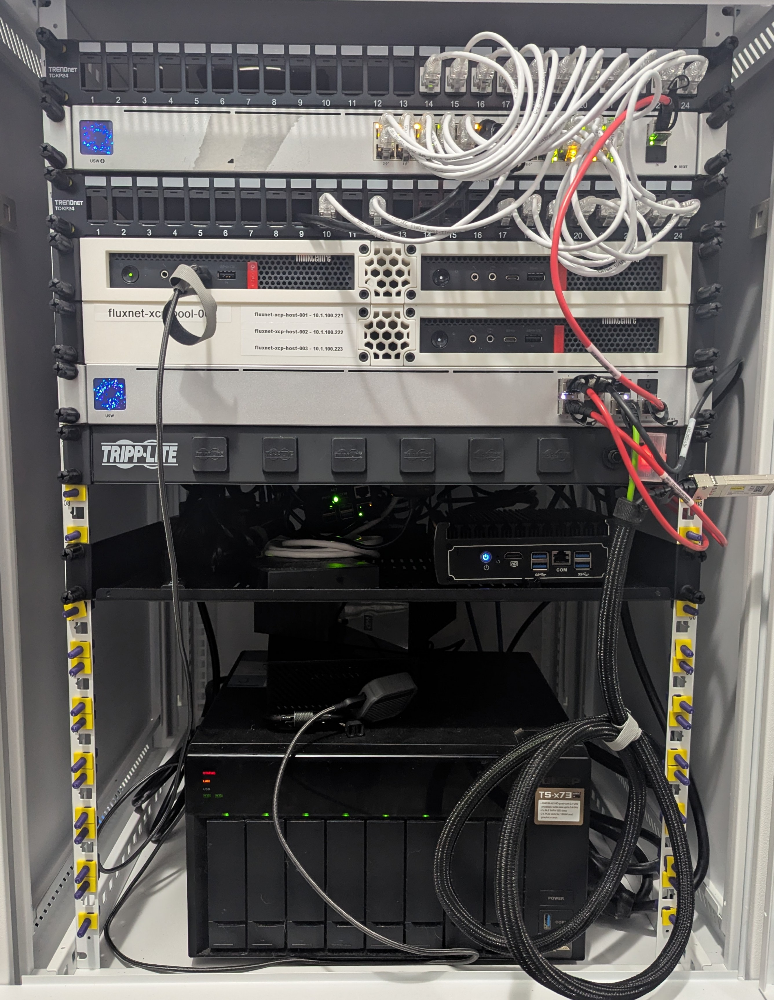
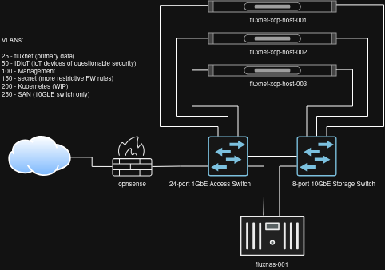

# fluxnet
Description, topology, and high-level configuration of my local fluxnet environment, to help simplify management and provide examples that others can apply in their own environments.

> This page (and this repo) is very much a very early Work-in-Progress.

## Core Components:

* [XCP-ng](https://xcp-ng.org/) + [Xen Orchestra](https://xen-orchestra.com/#!/xo-home)
* [OPNsense](https://opnsense.org/)
* [Unifi](https://ui.com/)
* [QNAP](https://www.qnap.com) NAS

## Hosts:

|   |   |
| --- | --- |
| Host(s) | 3x Lenovo M720q |
| CPU | Intel Core i7-8700t |
| RAM | 32GB |
| Storage | 120GB+ NVMe |
| Network (onboard) | 1GbE |
| Network (additional) | 2x 10GbE (10Gtek [Intel 82599ES Controller]) |

### fluxnet-xcp-host-001

|   |   |   |
| --- | --- | --- |
| vlan100_management | 10.1.100.221 | 1GbE |
| vlan250_storage | 10.1.250.221 | 10GbE |

### fluxnet-xcp-host-002

|   |   |   |
| --- | --- | --- |
| vlan100_management | 10.1.100.222 | 1GbE |
| vlan250_storage | 10.1.250.222 | 10GbE |

### fluxnet-xcp-host-003

|   |   |   |
| --- | --- | --- |
| vlan100_management | 10.1.100.223 | 1GbE |
| vlan250_storage | 10.1.250.223 | 10GbE |

## VLANs:

|  VLAN | Logical Name | Description |
| --- | --- | --- |
| 25 | vlan25_fluxnet | Primary Data |
| 50 | vlan50_idiot | IoT Devices | 
| 100 | vlan100_management | Management |
| 120 | vlan120_voice | VoIP (Future) |
| 150 | vlan150_secnet | Secure Devices |
| 200 | vlan200_kubernetes | Kubernetes (Future) |
| 250 | vlan250_storage | Storage/SAN - 10GbE links |

## Storage Repositories:

| Name | SR Type | Protocol | Medium | IP Address |
| --- | --- | --- | --- | --- |
| ISO | ISO | NFS | HDD (RAID 6) | 10.1.250.250 |
| vmstore_001 | VM | iSCSI | HDD (RAID 6) | 10.1.250.250 |
| vmstore_nfs_001 | VM | NFS | HDD (RAID 6) | 10.1.250.250 |
| vmstore_ssdO_nfs_001 | VM | NFS | SSD (6Gb/s SATA, RAID 0) | 10.1.250.250 |

## Backup Repositories:

| Name | Protocol | Medium | IP Address |
| --- | --- | --- | --- |
| vm_backups | NFS | HDD (RAID 6) | 10.1.250.250 |

## Xen Orchestra:

|   |   |   |
| --- | --- | --- |
| vlan100_management | 10.1.100.220 | 1GbE |
| vlan250_storage | 10.1.250.220 | 10GbE |